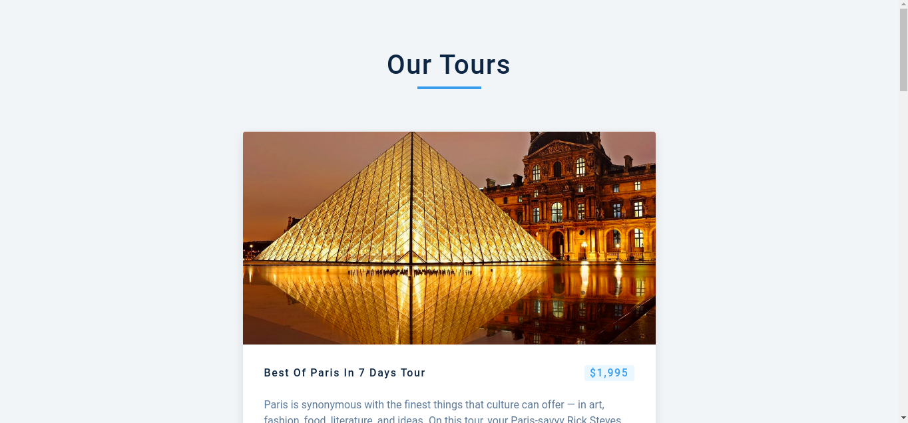
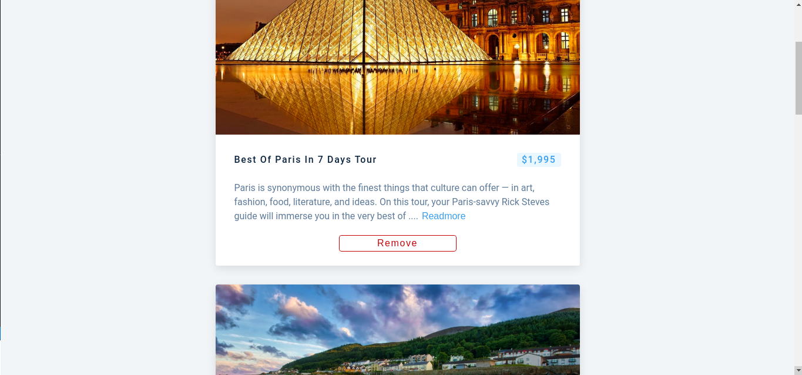

# Tours

| Image 1                                      | Image 2                                      |
| -------------------------------------------- | -------------------------------------------- |
|  |  |

## Infrastructure

- React

## Run

Clone this repository, cd into it then run `npm i && npm start`
